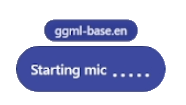
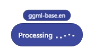

<p align="center">
  
</p>

<h1 align="center">VoiceType</h1>

A local, privacy-preserving dictation tool for Windows. Press a hotkey, speak, and the
transcribed text is inserted at your cursor. VoiceType offers two ways to dictate — a
**hold-to-talk** hotkey and a hands-free **toggle** mode. All speech recognition runs
**locally** using [whisper.cpp](https://github.com/ggml-org/whisper.cpp) — nothing is sent
to the cloud.

---

## Dictation modes

VoiceType supports two complementary ways to dictate:

| Mode | Default hotkey | How it works |
|------|----------------|--------------|
| **Hold-to-talk** | **Ctrl + Space** | **Press and hold** the keys while you speak; **release** to stop. Recording lasts only as long as you hold the combo. Best for short, quick dictation. |
| **Toggle (hands-free)** | **Ctrl + Shift + Space** | **Tap** the combo once to start listening (you can let go of the keys); **tap it again** to stop. Best for longer, hands-free dictation. Single-clicking the tray icon does the same thing. |

Both hotkeys are configurable in the Settings window and take effect immediately after saving.

**Behavior notes:**

- A toggle press is **ignored while a hold-to-talk session is active**, so the two paths never collide.
- The two combos use **exact modifier matching**, so `Ctrl + Space` and `Ctrl + Shift + Space` never cross-trigger each other even though they share the `Space` key.
- In toggle mode you can optionally enable **"automatically stop when the mic is idle"** so a forgotten session stops itself after a configurable timeout — in addition to tapping the hotkey again.

---

## Running & the system tray

VoiceType has **no main window** — it runs windowless from the **system tray**. The tray
icon (a white microphone) is the app's control center. Interact with it as follows:

- **Single left-click** — toggles a hands-free dictation session (start/stop), the same as the
  **Ctrl + Shift + Space** toggle hotkey. Can be enabled/disabled in Settings and via the menu.
- **Double-click** — opens the Settings window.
- **Right-click** — opens the menu:

- **Model** — pick from the Whisper models found in the models folder; the active one is checked.
  Selecting a model switches it live (in `Server` mode the whisper-server is restarted to load it).
- **Open Settings** — opens the Settings window (also available by **double-clicking** the tray icon).
- **Toggle mode** — a checkable item that enables/disables single-click toggle dictation.
- **Exit** — shuts the app down.

The tray icon and its tooltip reflect the current state (idle vs listening) and which mode is
active (hold-to-talk hotkey vs hands-free toggle).

Fatal errors and status notes are surfaced as tray balloon notifications.

---

## Floating status pill

While you dictate, a small **floating pill** appears near the bottom-center of the primary
screen and shows what VoiceType is doing. A bubble above the pill displays the **active
model** name (e.g. `ggml-base.en`).

The pill is **click-through** and **non-activating** — it never steals focus or interferes
with the app you are dictating into, so text still lands at your cursor. It cycles through
these states:

| State | What you see | Meaning |
|-------|--------------|---------|
| Starting mic | "Starting mic" with bobbing wave dots | The microphone is being opened. |
| Listening | A live traveling-wave waveform that reacts to your voice level | Recording your speech. |
| Processing | "Processing" with animated wave dots | Whisper is transcribing the captured audio. |

<p align="center">
  
  &nbsp;&nbsp;
  
  &nbsp;&nbsp;
  
</p>

The pill hides automatically once the transcribed text has been inserted, and it can also
show brief informational messages.

---

## Settings window

The Settings window is the recommended way to configure VoiceType (you don't have to edit
`appsettings.json` by hand). It lets you set the **model**, **microphone**, **transcription
mode**, **hotkey** (hold-to-talk), **language**, **insert method**, temp directory, preview
timings, and the per-mode executable/server fields. A dedicated **Toggle mode** section lets
you set the **toggle hotkey** and the hands-free options (use tray icon for toggle, automatic
idle stop and its timeout). It opens **single-instance** — reopening focuses the existing
window instead of creating a second one.

### Capturing a hotkey

Each hotkey field is a **press-to-capture** box: click it, press the desired key combination
(e.g. `Ctrl + Space`), and it's captured. Press `Esc` to cancel and keep the previous value.
An incomplete combo (such as a lone modifier) is rejected with a validation message.

### How changes are applied

Click **Save** to validate and persist all fields to
[`appsettings.json`](VoiceType/VoiceType/appsettings.json). Most changes take effect
**immediately, without restarting the app**:

| Change | When it applies |
|--------|-----------------|
| Model | Live. In `Server` mode the whisper-server restarts to load the new model; `Cli`/`Stream` pick it up on the next dictation. |
| Transcription mode | Live. The server is created/disposed and the controller is re-wired. |
| Hotkey (hold-to-talk and toggle) | Live. Both global hotkeys are re-registered immediately. |
| Server executable / host / port / arguments | Live in `Server` mode — the server restarts to pick up the new launch settings. |
| Language, insert method, clipboard restore, temp dir, preview timings | Live on the next dictation session. |
| Microphone | Applies on the **next** dictation session (a mid-session switch is avoided). If a session is in progress when you save, a tray note reminds you. |

Invalid values (non-positive numbers, an out-of-range port `1–65535`, or an incomplete
hotkey such as a lone modifier) are rejected with a validation message and nothing is saved.
**Cancel** closes the window without applying changes.

---

## Speech recognition models (required — download separately)

The Whisper model files (`*.bin`) are **not stored in this repository** because they exceed
GitHub's 100 MB per-file limit. You must download a model manually and place it in the
models folder before the app can transcribe.

### 1. Where to download

Download the pre-converted **GGML** models from the official whisper.cpp model repository on
Hugging Face:

- **Repository:** `ggerganov/whisper.cpp` (mirror: `ggml-org/whisper.cpp`)
- **Direct URL pattern:** `https://huggingface.co/ggerganov/whisper.cpp/resolve/main/<filename>`

> Only GGML `.bin` files work with whisper.cpp. Do **not** use `openai/whisper-*` or
> `Systran/faster-whisper-*` repos — those are PyTorch / CTranslate2 formats for other engines.
>
> If Hugging Face is blocked on your network, download on another machine/network and copy the
> `.bin` file over. Prefer the official repo over random re-uploads for integrity.

### 2. Which model to pick

| Model file | Disk size | Resident RAM (approx.) | Accuracy | Notes |
|------------|-----------|------------------------|----------|-------|
| `ggml-base.en.bin` | ~142 MB | ~210 MB | Baseline | Fastest, least accurate. Good for low-RAM machines. |
| `ggml-small.en.bin` | ~466 MB | ~550–650 MB | Big step up | **Best accuracy-per-MB for English dictation.** |
| `ggml-large-v3-turbo-q5_0.bin` | ~547 MB | ~800 MB–1.1 GB | Near-best | Latest Whisper model (Oct 2024). Use CLI mode if RAM is tight. |

`large-v3-turbo` is the newest OpenAI Whisper model; there is no v4. The `-q5_0` suffix is a
quantized (smaller/faster) build with negligible accuracy loss.

### 3. Where to place it

Copy the downloaded `.bin` into the **source** models folder:

```
VoiceType/VoiceType/whisper.cpp/models/
```

The build copies model files to the output folder automatically. After placing the file,
rebuild so it lands in `bin/.../whisper.cpp/models/`.

### 4. Point the app at your model

Edit [`VoiceType/VoiceType/appsettings.json`](VoiceType/VoiceType/appsettings.json) and set
`WhisperModelPath` to your file:

```json
"WhisperModelPath": "./whisper.cpp/models/ggml-small.en.bin"
```

---

## Transcription modes

Set `"Mode"` in `appsettings.json`. All modes run the same engine and produce the same
accuracy for a given model — they differ in **latency and memory profile**.

| Mode | How it works | Latency | Idle RAM | Best for |
|------|--------------|---------|----------|----------|
| `Server` | Long-lived `whisper-server.exe` keeps the model loaded; each utterance is an HTTP call | **Lowest** (no reload) | Model stays resident | Frequent dictation, fast response |
| `Cli` | Spawns `whisper-cli.exe` per utterance; loads model, transcribes, exits | Higher (reload each time) | ~0 (freed after each use) | Occasional dictation, low-RAM machines, large models |
| `WavFile` | Records to WAV, then transcribes with the CLI executable | Higher | ~0 | Simple fallback |
| `Stream` | Real-time `whisper-stream.exe` (sliding window) | Low | Model resident | **Not recommended** — produces repeated/corrected text |

If `Server` mode fails to start, the app automatically **falls back to CLI**.

### Server mode settings

```json
"WhisperServerExecutablePath": "./whisper.cpp/whisper/Release/whisper-server.exe",
"WhisperServerHost": "127.0.0.1",
"WhisperServerPort": 51234,
"WhisperServerArguments": "-bs 8 -bo 8 -mc 0"
```

`WhisperServerArguments` passes decoding flags to improve accuracy:

- `-bs 8` beam size (higher = more accurate, slower; also uses more RAM)
- `-bo 8` best-of candidates
- `-mc 0` max context = 0 (reduces repetition/hallucination for short dictation)

The port is in the private range (49152–65535) to avoid conflicts with common services on 8080.
The same flags work in CLI mode via `WhisperCliArguments`.

---

## Choosing settings for your RAM

**Check your available RAM first** (Task Manager → Performance → Memory). The *free* amount
matters more than the total.

| Your situation | Recommended setup |
|----------------|-------------------|
| **Plenty free (>3 GB)** | `large-v3-turbo-q5_0` + `Server` mode — best accuracy, fast |
| **Moderate (1.5–3 GB free), 16 GB total** | `small.en` + `Server` mode — big accuracy gain, ~600 MB resident |
| **Tight (<1.5 GB free)** | `base.en` + `Server`, **or** `large-v3-turbo` + **`Cli`** mode (loads only during transcription, frees after) |
| **Very constrained / infrequent use** | `base.en` + `Cli` mode — near-zero idle memory |

**Key trade-off:** Server mode holds the model in RAM permanently for speed. CLI mode uses
almost no idle RAM but reloads the model on every dictation (2–4 s extra for large models).
On a 16 GB machine that's already near capacity, avoid keeping a large model resident in
Server mode — either use a smaller model or switch that large model to CLI mode.

### Reducing memory of a large model
- Lower beam search: change `-bs 8 -bo 8` toward `-bs 1` (less RAM, slightly less accurate)
- Use a quantized build (`q5_0`, `q5_1`) instead of the full-precision model

---

## Hotkey & insertion

```json
"DictationHotkey": "Ctrl+Space",
"ToggleHotkey": "Ctrl+Shift+Space",
"InsertMethod": "Clipboard"
```

`DictationHotkey` is the **hold-to-talk** combo (hold **Ctrl + Space**, speak, release).
`ToggleHotkey` is the hands-free **toggle** combo (tap **Ctrl + Shift + Space** to start, tap
again to stop). `InsertMethod` can be `Clipboard` (paste, default) or `SendInput` (synthetic
typing).

---

## Audio

Microphone is captured at **16 kHz mono 16-bit** — Whisper's native format, so no resampling
is needed. Speak close to the mic in a quiet environment for best accuracy.

---

## App icon

The app icon is a white microphone glyph. It is drawn programmatically by
[`Assets/generate-icon.ps1`](VoiceType/VoiceType/Assets/generate-icon.ps1), which renders the
multi-resolution [`Assets/voicetype.ico`](VoiceType/VoiceType/Assets/voicetype.ico); a matching
256&nbsp;px [`Assets/voicetype.png`](VoiceType/VoiceType/Assets/voicetype.png) (used in this
README) is produced by [`Assets/generate-png.ps1`](VoiceType/VoiceType/Assets/generate-png.ps1).
An early [`Assets/voicetype.svg`](VoiceType/VoiceType/Assets/voicetype.svg) exists as the
original design reference. The `.ico` is
embedded into the executable (`<ApplicationIcon>`) for Explorer/taskbar/Alt-Tab and window
title bars, and is also copied to the output folder so the tray icon can load the best-fitting
small frame at runtime.

> If you change the icon, rebuild **and fully restart** the app — a running debugger instance
> keeps the old embedded/loaded icon until then.