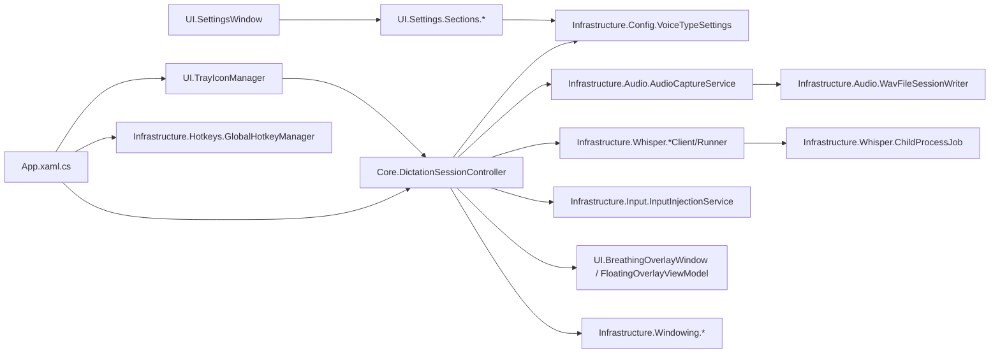

# CODE_SUMMARY

> Low-token structural map of the VoiceType codebase. Read this before exploring the codebase
> with search tools for a new task. Update it when a project/component is added, a structural
> class's responsibility changes, or a dependency between components changes — not for routine
> bug fixes.

## Overview
VoiceType is a single-project WPF app (.NET 8, C# 12) that runs windowless from the system tray.
It captures microphone audio, transcribes it locally via whisper.cpp (CLI, long-lived Server, or
real-time Stream backend), runs the transcript through a post-processing pipeline, and inserts the
result at the cursor (clipboard paste or synthetic typing).

## Dependency graph

## Symbol index

| Symbol | File | Responsibility |
|---|---|---|
| `App` | `App.xaml.cs` | App lifecycle, single-instance mutex, wires hotkeys/controller/tray at startup. |
| `DictationSessionController` | `Core/DictationSessionController.cs` | Orchestrates start/stop dictation, transcript post-processing pipeline (`CleanTranscript`), text insertion. |
| `DictationState` | `Core/DictationState.cs` | Enum: Idle, Listening, Previewing, Finalizing, Committing, Error. |
| `AudioCaptureService` | `Infrastructure/Audio/AudioCaptureService.cs` | Captures mic audio via `WaveInEvent`, raises level/raw-audio events, writes to session writer. |
| `AudioLevelMeter` | `Infrastructure/Audio/AudioLevelMeter.cs` | RMS-based audio level normalization (0.0–1.0) from 16-bit PCM. |
| `WavFileSessionWriter` | `Infrastructure/Audio/WavFileSessionWriter.cs` | Writes 16-bit mono PCM WAV files with RIFF headers. |
| `AudioDataEventArgs` | `Infrastructure/Audio/AudioDataEventArgs.cs` | Event args carrying a raw audio buffer + bytes recorded. |
| `VoiceTypeSettings` | `Infrastructure/Config/VoiceTypeSettings.cs` | Persisted settings model (transcription mode, hotkeys, post-processing toggles, filler words, etc.). |
| `SettingsLoader` | `Infrastructure/Config/SettingsLoader.cs` | Loads/saves `VoiceTypeSettings` to `appsettings.json`. |
| `GlobalHotkeyManager` | `Infrastructure/Hotkeys/GlobalHotkeyManager.cs` | Low-level keyboard hook (`WH_KEYBOARD_LL`) for global hold-to-talk/toggle hotkeys; supports live re-registration. |
| `ClipboardHelper` | `Infrastructure/Input/ClipboardHelper.cs` | Clipboard text set/backup/restore with retry logic for lock contention. |
| `InputInjectionService` | `Infrastructure/Input/InputInjectionService.cs` | Inserts text via clipboard paste or synthetic character typing. |
| `Logger` | `Infrastructure/Logging/Logger.cs` | Static timestamped logging to Debug/Console/log file. |
| `ChildProcessJob` | `Infrastructure/Whisper/ChildProcessJob.cs` | Windows Job Object (KILL_ON_JOB_CLOSE) ensuring whisper child processes die with the app. |
| `WhisperFinalTranscriber` | `Infrastructure/Whisper/WhisperFinalTranscriber.cs` | Facade over `WhisperProcessRunner` for single-shot final transcription. |
| `WhisperProcessRunner` | `Infrastructure/Whisper/WhisperProcessRunner.cs` | Spawns whisper-cli per utterance; resolves exe/model paths; parses JSON result. Also model enumeration (`EnumerateModels`). |
| `WhisperServerClient` | `Infrastructure/Whisper/WhisperServerClient.cs` | Owns long-lived `whisper-server.exe`; posts WAV to `/inference`; handles live model switching. |
| `WhisperStreamClient` | `Infrastructure/Whisper/WhisperStreamClient.cs` | Streams PCM16 audio to `whisper-stream.exe` stdin; reads live partial/final text from stdout. |
| `FocusedControlInspector` | `Infrastructure/Windowing/FocusedControlInspector.cs` | Detects whether the focused control accepts text input (Win32 class filter + UI Automation fallback). |
| `ForegroundWindowMonitor` | `Infrastructure/Windowing/ForegroundWindowMonitor.cs` | WinEvent hook tracking the last real foreground window (excludes own process/shell). |
| `ForegroundWindowTracker` | `Infrastructure/Windowing/ForegroundWindowTracker.cs` | Captures/restores foreground window + focus handle. |
| `FinalTranscriptionResult` | `Models/FinalTranscriptionResult.cs` | Result DTO: success, text, error message, exit code, timed-out flag. |
| `BreathingOverlayWindow` | `UI/BreathingOverlayWindow.xaml.cs` | Floating pill overlay with traveling-wave waveform animation synced to audio amplitude. |
| `CompactOverlayWindow` | `UI/CompactOverlayWindow.xaml.cs` | Simple bottom-center-positioned overlay window. |
| `SettingsWindow` | `UI/SettingsWindow.xaml.cs` | Searchable TreeView master-detail settings shell; owns Save/Cancel and live-apply diffing. |
| `TrayIconManager` | `UI/TrayIconManager.cs` | `NotifyIcon` control center: model menu, open Settings, toggle mode, exit; state-reflecting icon/tooltip. |
| `FloatingOverlayViewModel` | `UI/ViewModels/FloatingOverlayViewModel.cs` | MVVM bindings for overlay: status text, audio level, waveform points, render mode. |
| `ISettingsSection` | `UI/Settings/ISettingsSection.cs` | Contract (`Title`, `SearchKeywords`, `Load`, `Validate`, `Save`) for each Settings page. |
| `NavNode` | `UI/Settings/NavNode.cs` | Hierarchical Settings navigation node with an optional selectable `ISettingsSection` host and child nodes. |
| `SettingsInput` | `UI/Settings/SettingsInput.cs` | Shared helpers: positive-int/port parsing with validation, executable file picker. |
| `GeneralSection`, `TranscriptionSection`, `DictationSection`, `TextInsertionSection`, `PostProcessingSection` | `UI/Settings/Sections/*.xaml(.cs)` | One `UserControl` per Settings page, registered in `SettingsWindow.xaml.cs`'s `_sections` list. |

## Key flows

- **Hold-to-talk dictation:** `GlobalHotkeyManager` (key down) → `DictationSessionController` starts session → `AudioCaptureService` records → (key up) → transcribe via `WhisperServerClient`/`WhisperProcessRunner`/`WhisperStreamClient` → `CleanTranscript` pipeline → `InputInjectionService` inserts text.
- **Toggle (hands-free) dictation:** Tray single-click or toggle hotkey → same session/transcribe/insert path as above, plus optional idle auto-stop.
- **Settings save:** `SettingsWindow.SaveButton_Click` → `Validate()` + `Save()` across all `ISettingsSection`s → `SettingsLoader.SaveAsync` → diff old/new values → live-apply (hotkeys, server restart, model switch, etc.).
- **Model switch (tray menu):** `TrayIconManager` menu click → `WhisperProcessRunner.EnumerateModels()` list → update `VoiceTypeSettings.WhisperModelPath` → `WhisperServerClient` restarts (Server mode) or picked up next dictation (Cli/Stream).
- **Text insertion fallback:** `FocusedControlInspector` checks focus → if not editable, `CopyToClipboardWhenNoEditable` copies text to clipboard + optional notification instead of typing/pasting.
